- [Livrables](#livrables)

- [Échéance](#%c3%89ch%c3%a9ance)

- [Quelques éléments à considérer](#quelques-%c3%a9l%c3%a9ments-%c3%a0-consid%c3%a9rer-pour-les-parties-2-et-3)

- [Travail à réaliser](#travail-%c3%a0-r%c3%a9aliser)

# Sécurité des réseaux sans fil

## Laboratoire 802.11 Sécurité WPA Entreprise

__A faire en équipes de deux personnes__

### Objectif :

1.	Analyser les étapes d’une connexion WPA Entreprise avec une capture Wireshark
2.	__(optionnel)__ Implémenter une attaque WPE (Wireless Pwnage Edition) contre un réseau WPA Entreprise
1.  __(optionnel)__ Implémenter une attaque GTC Dowgrade contre un réseau WPA Entreprise


## Quelques éléments à considérer pour les parties 2 et 3 :

Les parties 2 et 3 sont optionnelles puisque vous ne disposez pas forcement du matériel nécessaire pour les réaliser.

En principe, il devrait être possible de démarrer vos machines en Kali natif (à partir d'une clé USB, avec une distro live par exemple) ou d'employer une autre version de Linux. Si vous n'avez pas une interface WiFi USB externe, __vous ne pouvez pas faire ces parties dans une VM Linux__. 

Dans le cas où vous arriverais à tout faire pour démarrer un Linux natif, il existe toujours la possibilité que votre interface WiFi ne puisse pas être configurée en mode AP, ce qui à nouveau empêche le déroulement des parties 2 e 3.

Ces deux parties sont vraiment intéressantes et __je vous encourage à essayer de les faire__, si vous avez les ressources. Malheureusement je ne peux pas vous proposer un bonus si vous les faites, puisqu'il risque d'y avoir des personnes qui n'auront pas la possibilité de les réaliser pour les raisons déjà expliquées.

Si toutes les équipes rendent le labo complet, il sera donc corrigé entièrement et les parties 2 et 3 seront considérées pour la note.

Si vous vous lancez dans ces deux parties, voici quelques informations qui peuvent vous aider :

- Solution à l’erreur éventuelle « ```Could not configure driver mode``` » :

```
nmcli radio wifi off
rfkill unblock wlan
```
-	Pour pouvoir capturer une authentification complète, il faut se déconnecter d’un réseau et attendre 1 minute (timeout pour que l’AP « oublie » le client) 
-	Les échanges d’authentification entreprise peuvent être facilement trouvés utilisant le filtre d’affichage « ```eap``` » dans Wireshark


## Travail à réaliser

### 1. Analyse d’une authentification WPA Entreprise

> Dans cette première partie, vous allez analyser [une connexion WPA Entreprise](files/auth.pcap) avec Wireshark et fournir des captures d’écran indiquant dans chaque capture les données demandées. Comparer [la capture](files/auth.pcap) au processus d’authentification donné en théorie (n’oubliez pas les captures d'écran pour illustrer vos comparaisons !). En particulier, identifier les étapes suivantes :

Pour commencer voici ce que nous avons vu en théorie au sujet de l'authentification WPA-Enterprise:

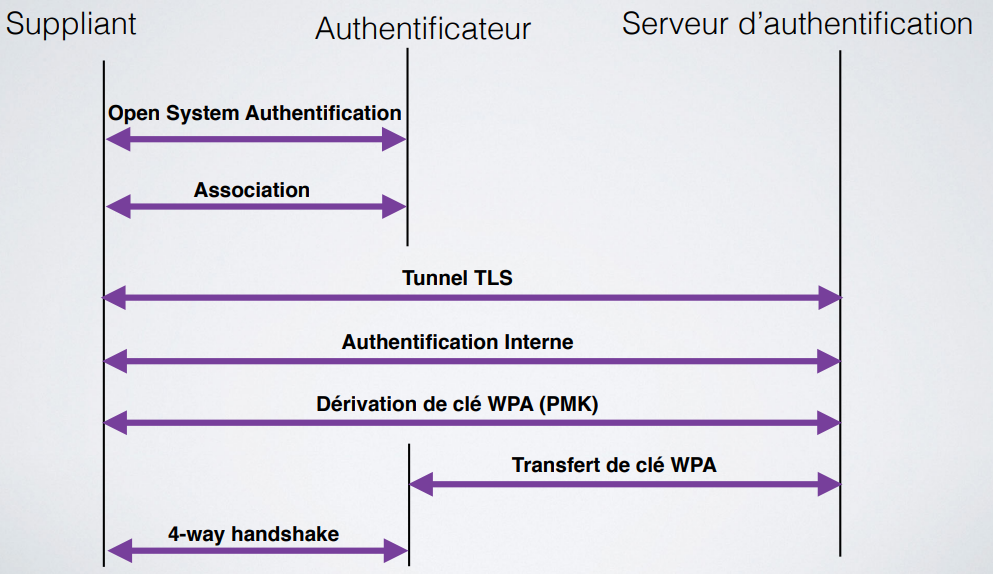

Dans la capture que nous avons reçu il y avait énormément de paquet qui ne nous intéressaient pas. Il a donc fallut trouver les échanges entre les parties. Pour cela nous avons, dans un premier temps, cherché les paquets avec le protocole "EAP" pour identifier le `suppliant` et l'`authentificateur`. Puis une fois ces deux entités identifiées nous avons appliquer un filtre qui nous a affiché que les échanges entre ces deux: `(wlan.sa == 30:74:96:70:df:32 && wlan.da == dc:a5:f4:4c:93:e0) or (wlan.da == 30:74:96:70:df:32 && wlan.sa == dc:a5:f4:4c:93:e0)`. Puis nous avons obtenu ceci :

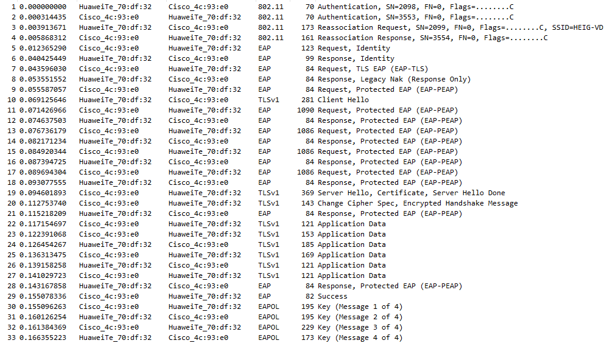
Nous pouvons clairement identifier toutes les étapes que nous avons vu en théorie. Nous allons maintenant nous intéresser aux différentes étapes plus précisément.

- Requête et réponse d’authentification système ouvert

  

  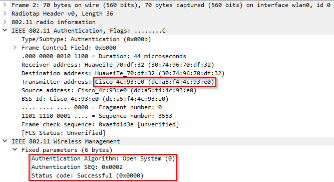

 	- Requête et réponse d’association (ou reassociation)
	
	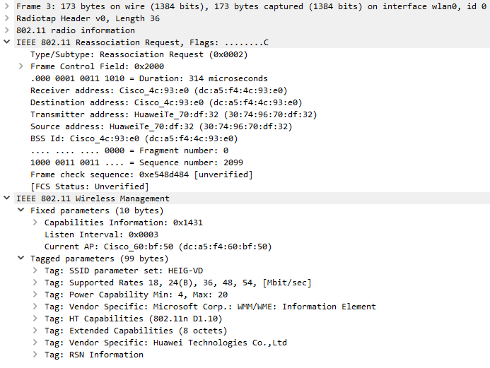
	
	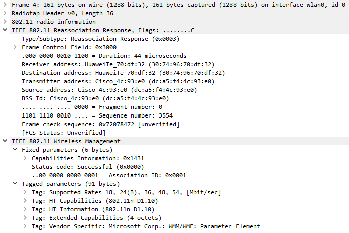
	
 	- Négociation de la méthode d’authentification entreprise
	
	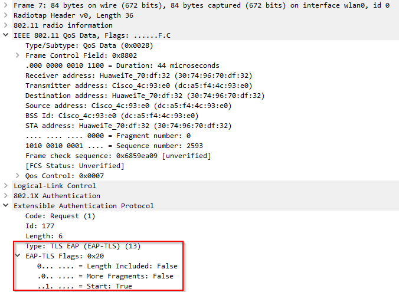
	
	Su l'image ci-dessus nous pouvons remarquer que l'AP (le serveur d’authentification en vérité) propose de faire l'échange à l'aide de `EAP-TLS`.
	
	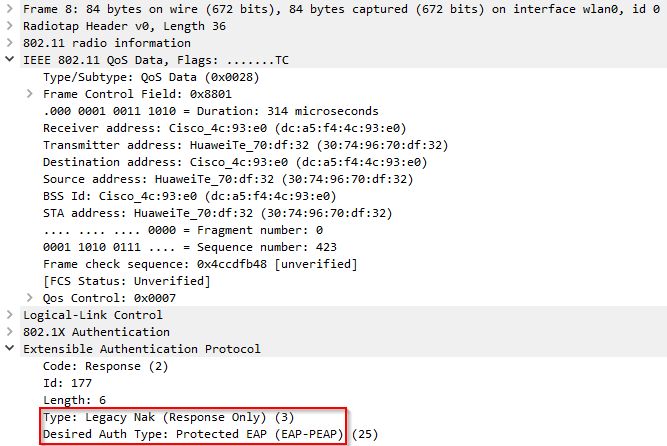
	
	Sur cette capture nous voyons que le client fait une contre-proposition avec comme protocole `EAP-PEAP`.
	
	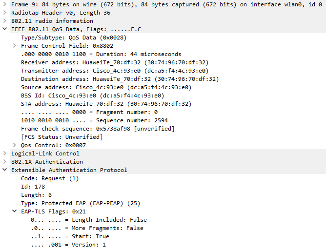
	
	Puis le serveur d'authentification accepte cette proposition. L'échange se fera donc avec `EAP-PEAP`.
	
 	- Phase d’initiation. Arrivez-vous à voir l’identité du client ?
	
	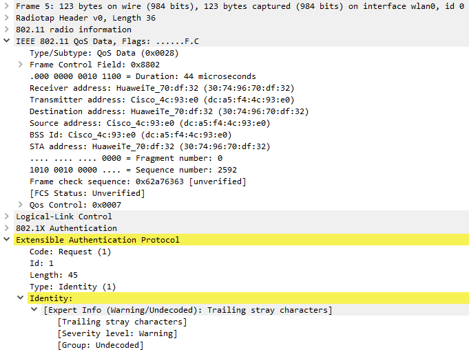
	
	La capture ci-dessus est la demande d'identité faite par le serveur d'authentification au client. Nous pouvons voir sur la capture ci-dessous que le client répond avec l'identité `einet\joel.gonin`.
	
	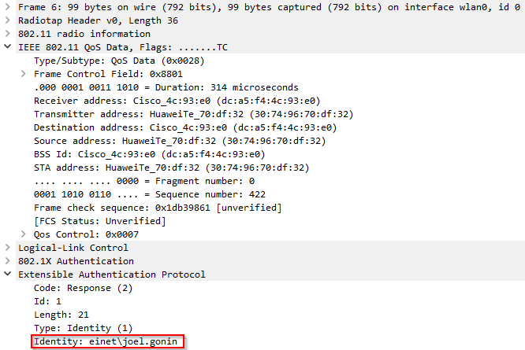
	
 	- Phase hello :
	
	Etant donné que le protocole sélectionné est `PEAP` les échanges qui se trouvent dans le carré rouge vont être effectués mais ils seront protégé par le tunnel donc nous ne pourront pas voir les informations. Nous pourront cependant voir quelques informations au sujet du tunnel TLS comme les nonces, les suites cryptographiques.
	
	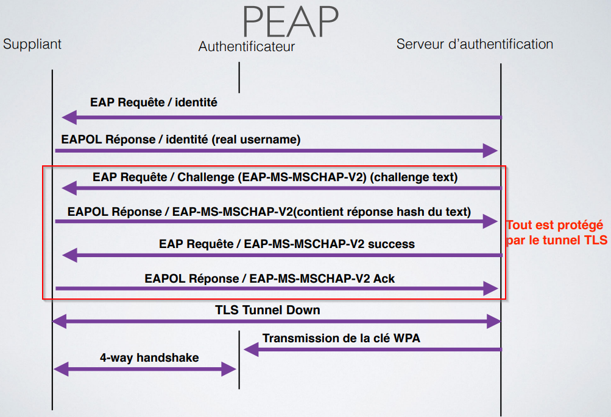
	
	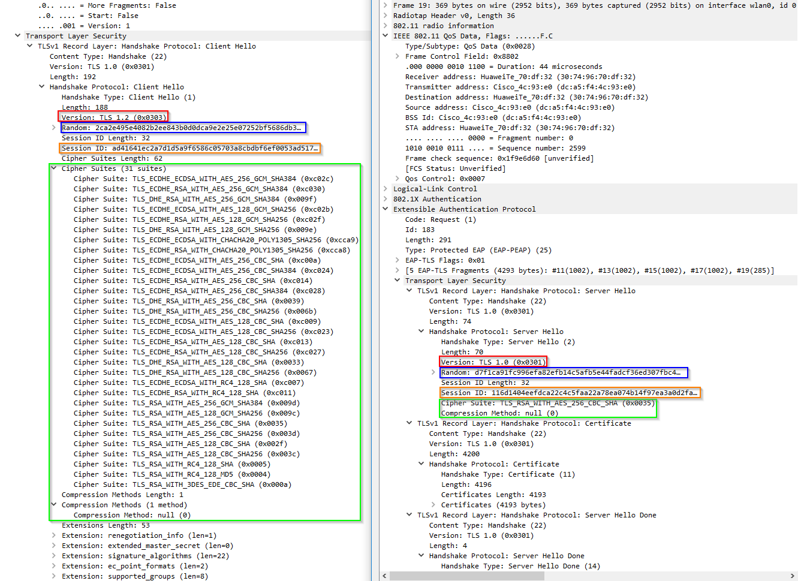
	
	- Version TLS
	
	  Pour ce qui est de la version de TLS le client propose d'utiliser `TLS 1.2` mais le serveur lui répond avec la version `TLS 1.0` (rectangle rouge sur la capture) 
	
	- Suites cryptographiques et méthodes de compression proposées par le client et acceptées par l’AP
	
	  Nous pouvons voir sur la capture que le client propose 31 suites cryptographique différentes. Le serveur va lui répondre qu'il a sélectionné la suite `TLS_RSA_WITH_AES_256_CBC_SHA`. Aucun des deux ne proposent de méthode de compression. (rectangle vert)
	
	- Nonces
	
	  Le nonce se trouvent dans les rectangles bleus
	
	- Session ID
	
	  Les ID de session se trouvent dans les rectangles oranges
	
	- Phase de transmission de certificats
	
	  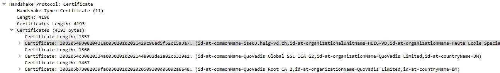
	
	  Nous pouvons voir ici que le serveur envoie 3 certificats différent qui est est à son nom puis deux autres qui sont au nom de "QuoVadis". Il suffit de faire une rapide recherche internet pour voir c'est c'est une entreprise qui fournis des certificats
	
	  - Echanges des certificats
	
	  - Change cipher spec
	
	    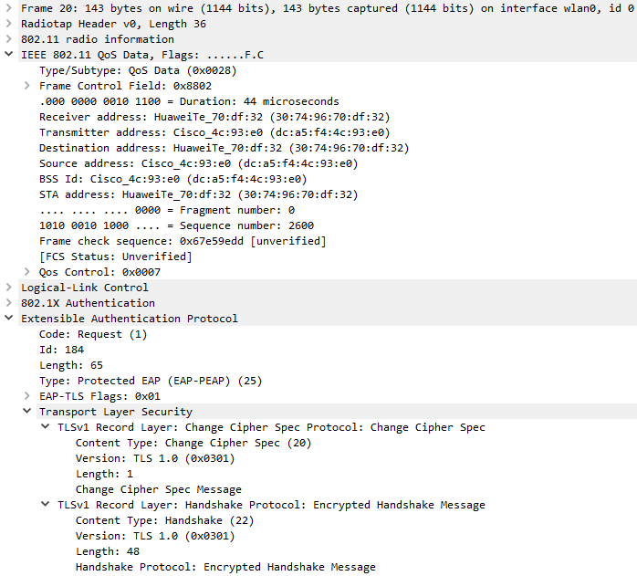
	
	    Nous avons ici le paquet "Change Cipher Spec Protocol". Cependant les informations qui se trouve à l'intérieur sont chiffrées, nous ne pouvons donc pas les voir.
	
- Authentification interne et transmission de la clé WPA (échange chiffré, vu comme « Application data »)

  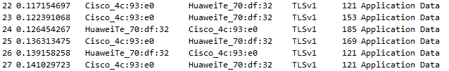

- 4-way handshake

  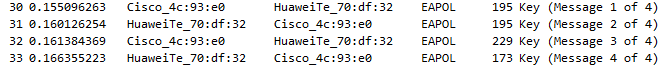

### Répondez aux questions suivantes :

> **_Question :_** Quelle ou quelles méthode(s) d’authentification est/sont proposé(s) au client ?
> 
> **_Réponse :_** Le serveur propose la methode `EAP-TLS`

---

> **_Question:_** Quelle méthode d’authentification est finalement utilisée ?
> 
> **_Réponse:_** Le client, lui, va proposer la méthode `PEAP` et c'est finalement cette méthode qui va être utilisé.

---

> **_Question:_** Lors de l’échange de certificats entre le serveur d’authentification et le client :
> 
> - a. Le serveur envoie-t-il un certificat au client ? Pourquoi oui ou non ?
> 
> **_Réponse:_** Comme montré plus haut le serveur envoie 3 certificats au client. Ces derniers permettent au client d'authentifié le serveur.
> 
> - b. Le client envoie-t-il un certificat au serveur ? Pourquoi oui ou non ?
> 
> **_Réponse:_** Comme le protocole utilisé est `PEAP` le client n'a pas besoin d'envoyer de certificat. En effet, dans PEAP le client est authentifié lors de la phase 2 (lorsque le tunnel est créé) à l'aide de MSCHAPv2.

---

### 2. (__Optionnel__) Attaque WPA Entreprise (hostapd)

Les réseaux utilisant une authentification WPA Entreprise sont considérés aujourd’hui comme étant très surs. En effet, puisque la Master Key utilisée pour la dérivation des clés WPA est générée de manière aléatoire dans le processus d’authentification, les attaques par dictionnaire ou brute-force utilisés sur WPA Personnel ne sont plus applicables. 

Il existe pourtant d’autres moyens pour attaquer les réseaux Entreprise, se basant sur une mauvaise configuration d’un client WiFi. En effet, on peut proposer un « evil twin » à la victime pour l’attirer à se connecter à un faux réseau qui nous permette de capturer le processus d’authentification interne. Une attaque par brute-force peut être faite sur cette capture, beaucoup plus vulnérable d’être craquée qu’une clé WPA à 256 bits, car elle est effectuée sur le compte d’un utilisateur.

Pour faire fonctionner cette attaque, il est impératif que la victime soit configurée pour ignorer les problèmes de certificats ou que l’utilisateur accepte un nouveau certificat lors d’une connexion.

Pour implémenter l’attaque :

- Installer ```hostapd-wpe``` (il existe des versions modifiées qui peuvent peut-être faciliter la tâche... je ne les connais pas. Dans le doute, utiliser la version originale). Lire la documentation du site de l’outil ou d’autres ressources sur Internet pour comprendre son utilisation
- Modifier la configuration de ```hostapd-wpe``` pour proposer un réseau semblable au réseau de l’école ou le réseau de votre préférence, sachant que dans le cas d'une attaque réelle, il faudrait utiliser le vrai SSI du réseau de la cible
- Lancer une capture Wireshark
- Tenter une connexion au réseau (ne pas utiliser vos identifiants réels)
- Utiliser un outil de brute-force (```john```, par exemple) pour attaquer le hash capturé (utiliser un mot de passe assez simple pour minimiser le temps)

### Répondez aux questions suivantes :

> **_Question :_** Quelles modifications sont nécessaires dans la configuration de hostapd-wpe pour cette attaque ?
> 
> **_Réponse :_** 

---

> **_Question:_** Quel type de hash doit-on indiquer à john pour craquer le handshake ?
> 
> **_Réponse:_** 

---

> **_Question:_** Quelles méthodes d’authentification sont supportées par hostapd-wpe ?
> 
> **_Réponse:_**


### 3. (__Optionnel__) GTC Downgrade Attack avec [EAPHammer](https://github.com/s0lst1c3/eaphammer) 

[EAPHammer](https://github.com/s0lst1c3/eaphammer) est un outil de nouvelle génération pour les attaques WPA Entreprise. Il peut en particulier faire une attaque de downgrade GTC, pour tenter de capturer les identifiants du client en clair, ce qui évite le besoin de l'attaque par dictionnaire.

- Installer ```EAPHammer```. Lire la documentation du site de l’outil ou d’autres ressources sur Internet pour comprendre son utilisation
- Modifier la configuration de ```EAPHammer``` pour proposer un réseau semblable au réseau de l’école ou le réseau de votre préférence. Le but est de réaliser une GTC Downgrade Attack.
- Lancer une capture Wireshark
- Tenter une connexion au réseau


### Répondez aux questions suivantes :

> **_Question :_** Expliquez en quelques mots l'attaque GTC Downgrade
> 
> **_Réponse :_** 

---

> **_Question:_** Quelles sont vos conclusions et réflexions par rapport à la méthode hostapd-wpe ?
> 
> **_Réponse:_** 


## Livrables

Un fork du repo original . Puis, un Pull Request contenant :

-	Captures d’écran + commentaires
-	Réponses aux questions

## Échéance

Le 8 juin 2020 à 23h59
